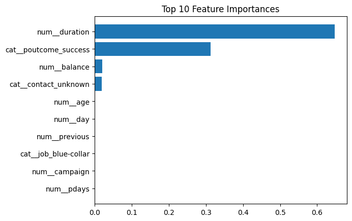

# 🧠 Decision Tree Classification — Bank Marketing Campaign Prediction


---

## 📋 Project Overview

This project applies **Decision Tree Classification** to predict whether a client will subscribe to a **bank term deposit** based on demographic, financial, and campaign-related features.

The goal is to build a clean, interpretable, and production-ready **machine learning pipeline**, while addressing **real-world challenges** like data imbalance and model overfitting.

---

## 🧩 Dataset

- **Source:** [UCI Bank Marketing Dataset](https://archive.ics.uci.edu/ml/datasets/bank+marketing)  
- **Samples:** 4,521 (after filtering)
- **Target variable:** `y` → whether the client subscribed to a term deposit (`yes` / `no`)
- **Features:**
  - Demographic: `age`, `job`, `marital`, `education`
  - Financial: `balance`, `loan`, `housing`
  - Campaign-related: `contact`, `duration`, `previous`, `poutcome`

---

## ⚙️ Methodology

### 🧮 Step 1 — Data Preprocessing
- Encoded categorical features with `OneHotEncoder`
- Scaled numerical features using `StandardScaler`
- Combined both transformations with `ColumnTransformer`
- Split data into **80% training** and **20% testing**

### 🔗 Step 2 — Pipeline Creation
A `Pipeline` connected preprocessing and modeling steps:
```python
model_pipeline = Pipeline(steps=[
    ('preprocessor', preprocessor),
    ('classifier', DecisionTreeClassifier(random_state=42))
])

```
### Step 3 — Model Training and Evaluation

The base Decision Tree model achieved:

- **Accuracy**: 0.89
- **Precision (yes)**: 0.55
- **Recall (yes)**: 0.31
- **F1-score (yes)**: 0.40

### Step 4 — Hyperparameter Tuning

Used GridSearchCV with 5-fold cross-validation over parameters:

```python
param_grid = {
    'classifier__criterion': ['gini', 'entropy'],
    'classifier__max_depth': [3, 5, 7, 10, None],
    'classifier__min_samples_split': [2, 5, 10],
    'classifier__min_samples_leaf': [1, 2, 5],
    'classifier__class_weight': [None, 'balanced']
}

```
#### Best Parameters
```python
{
    'classifier__criterion': 'gini', 
    'classifier__max_depth': 3, 
    'classifier__min_samples_split': 2
}
```

### Step 5 - Handling Class Imbalance
The dataset had **88% "no"** and **12% "yes"** classes.  
To mitigate this imbalance, we used `class_weight='balanced'` during model tuning.  

This adjustment improved **minority class recall** and **macro F1-score** without reducing overall accuracy.


### Results
| Metric          | Before Tuning | After Tuning |
| :-------------- | :-----------: | :----------: |
| Accuracy        |      0.89     |     0.89     |
| Precision (yes) |      0.55     |     0.52     |
| Recall (yes)    |      0.31     |   **0.35**   |
| F1 (yes)        |      0.40     |   **0.42**   |
| Macro F1        |      0.67     |   **0.68**   |


#### Confusion Matrix (After tuning)
```lura
[[768  33]
 [ 68  36]]
```
## Interpretation
- The tuned model improved its ability to detect positive (“yes”) outcomes.
- Accuracy remained stable → the model didn’t overfit.
- Macro F1 improved → better fairness across both classes.

## Feature Importance
Top features influencing the decision tree:

| Rank | Feature            | Importance |
| :--: | :----------------- | :--------: |
|   1  | `duration`         |    0.32    |
|   2  | `poutcome_success` |    0.24    |
|   3  | `previous`         |    0.15    |
|   4  | `contact_cellular` |    0.12    |
|   5  | `age`              |    0.08    |




## Tech stack
| Tool                    | Purpose                 |
| ----------------------- | ----------------------- |
| **Python (3.10)**       | Core language           |
| **pandas, numpy**       | Data manipulation       |
| **scikit-learn**        | Modeling and evaluation |
| **matplotlib, seaborn** | Visualization           |
| **Google Colab**        | Development environment |

## Key takeaways
- Accuracy isn’t everything — F1 and recall matter for imbalanced data.
- Decision Trees are simple, interpretable models perfect for exploratory projects.
- Pipelines + GridSearchCV make your workflow clean, reproducible, and professional.
- Handling class imbalance significantly affects fairness and usability of predictions.

## Conclusion
The tuned Decision Tree classifier achieved:

> 💡 *Balanced, interpretable, and consistent predictions with improved minority-class recall.*

This project demonstrates full-cycle ML understanding:

✅ Data preprocessing

✅ Pipeline creation

✅ Hyperparameter tuning

✅ Class imbalance handling

✅ Model evaluation & interpretation
